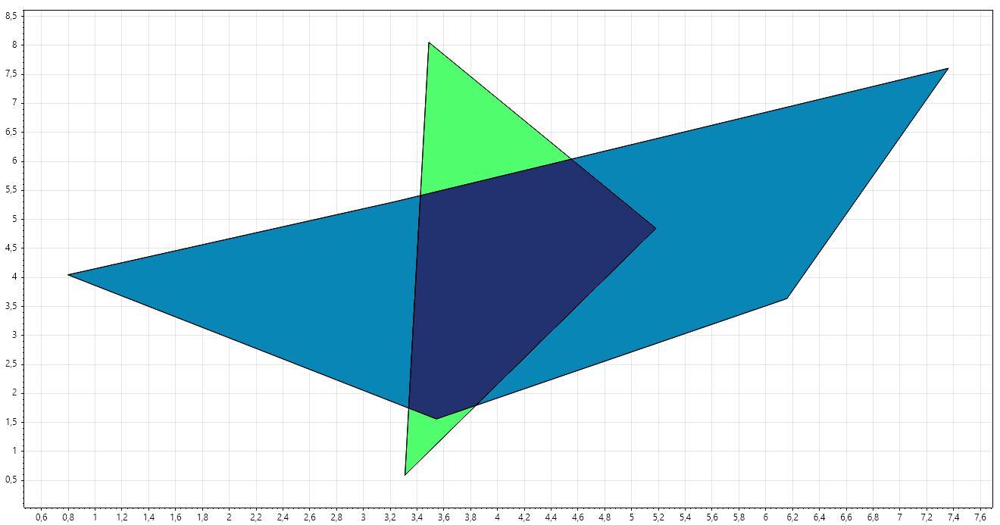

# ConvexPolygonClipper O(N^2^)

## Об алгоритме

Данный алгоритм применим только к выпуклым многоугольникам.

В алгоритме присутствует парочка простых операций:
1. Нахождения пересечения двух отрезков O(1).
1. Определение нахождения точки в полигоне O(N).
1. Сортировка точек по часовой стрелке О(N*log(N)).

## Этапы алгоритма: 

1. Нахождение точек первого полигона, которые находятся в полигоне 2 О(N^2^).
1. Нахождение точек второго полигона, которые находятся в полигоне 1 O(N^2^).
1. Нахождение точек пересечения рёбер полигонов О(N^2^):
    1. Берём каждое ребро первого полигона - фиксируем его. 
    1. Перебираем каждое ребро второго полигона и пытаемся найти пересечение с фиксированным ребром.
1. Сортируем все найденные точки по часовой стрелке О(N*log(N)).

