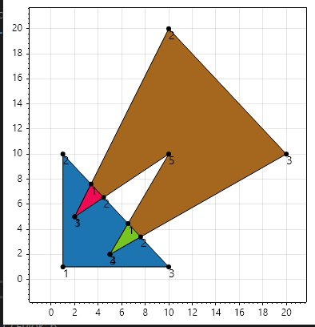
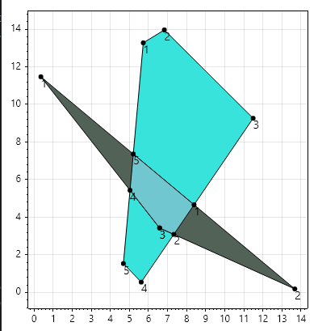

# Weiler-Atherton polygon clipper algorithm O(N^2^)

## Ограничения алгоритма

Алгоритм применяется к двум многоугольникам (субъектному и клиппующему), вершины которых упорядочены по часовой стрелки (для внешних контуров).

## Этапы алгоритма:

1. Найти все точки пересечения рёбер субъектного и клиппующего многоугольников. О(N^2^).
    1. Вставить найденные точки пересечения в оба многоугольника, сохраняя порядок вершин по часовой стрелке.
    1. Каждой точке пересечения присвоить метку, либо Enter, либо Exit:

   Enter (вход в клиппующую область) — если переход из субъектного многоугольника в клиппующий.

   Exit (выход из клиппующей области) — если переход обратно в субъектный многоугольник.

1. Построение результирующих многоугольников О(N^2^):
    1. Начать обход субъектного многоугольника, пока не встретится точка Enter.

    1. Переключиться на клиппующий многоугольник в точке Enter и продолжить обход.

    1. При достижении точки Exit вернуться к субъектному многоугольнику.

    1. Повторять переключения между многоугольниками при встрече Enter/Exit, пока не будет достигнута начальная точка. Это формирует один из результирующих полигонов.

    1. Повторять процесс для всех непосещённых точек пересечения.

## Проблемы моей реализации

Есть проблема, когда точка пересечения - это сама точка многоугольника, тогда алгоритм работает некорректно(можно в суббъектный добавить одну и точку два раза одну с флагом Exit, а другую c Enter)

